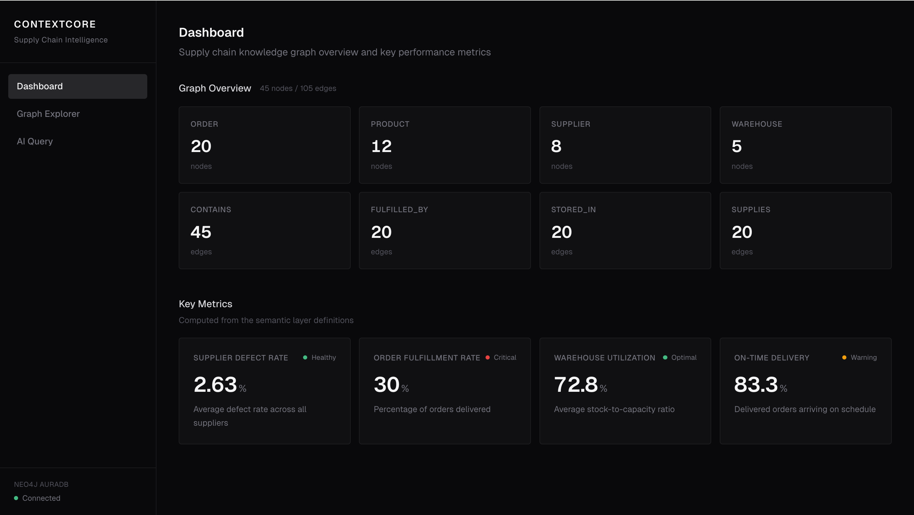
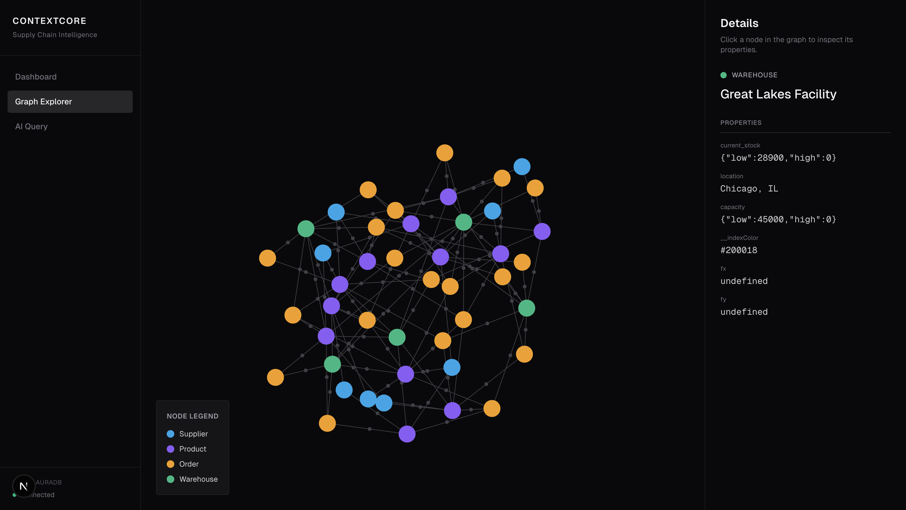
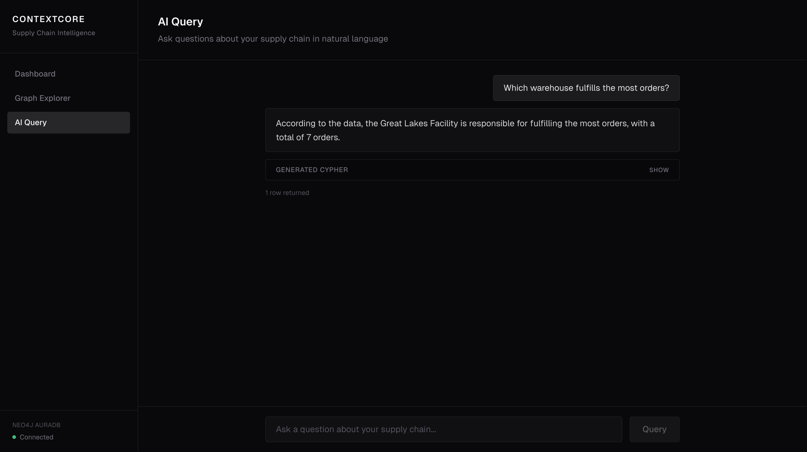

# ContextCore







Enterprise supply chain knowledge graph + semantic layer with an AI query interface.

## Tech Stack

- **Frontend**: Next.js 14 (App Router), Tailwind CSS
- **Graph Database**: Neo4j AuraDB (free tier)
- **Semantic Layer**: dbt Core (YAML metric definitions)
- **Data Pipeline**: Python
- **AI/LLM**: Ollama (llama3, local)

## Branch Roadmap

| Branch | Feature |
|---|---|
| `feat/neo4j-schema` | Neo4j connection + supply chain seed data |
| `feat/semantic-layer` | dbt YAML metric definitions + context contracts |
| `feat/ui-dashboard` | Next.js dashboard with graph overview + metrics |
| `feat/ai-query` | Natural language to Cypher via Ollama |
| `feat/graph-viz` | Interactive graph visualization |

## Project Structure

This repository is organized into distinct logical components:

- **`data-pipeline/`**: Python scripts for generating mock supply chain data and securely seeding the Neo4j graph database. Contains schema verification and robust Cypher ingestion logic.
- **`semantic-layer/`**: A dbt Core project defining context contracts. It centralizes key performance metrics (defect rates, fulfillment, etc.) using YAML, abstracting complex Cypher logic away from the frontend.
- **`web/`**: The Next.js 14 frontend application.
  - `src/app/api/`: Server-side API routes for executing LLM queries, computing metrics, and extracting full graph data.
  - `src/app/`: The UI pages (Dashboard, AI Query, Graph Explorer) built with Tailwind CSS.
  - `src/lib/`: Core utilities including the Neo4j driver connection and schema definitions for the LLM context.
- **`docs/`**: Assets and documentation screenshots.

## Getting Started

### Prerequisites

- Python 3.10+
- Node.js 18+
- Neo4j AuraDB instance (free tier)
- Ollama (with llama3 model)

### Data Pipeline Setup

```bash
cd data-pipeline
python -m venv venv
source venv/bin/activate
pip install -r requirements.txt
cp ../.env.example ../.env
# Edit .env with your Neo4j credentials
python seed.py
python verify.py
```
